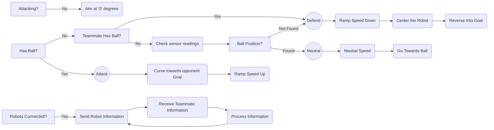

# `NOT FINISHED YET!`
# Monkey Madness
## Soccer Standard - *2022 RoboCup Junior Australia*

### **Contents:**
- [Introduction](https://github.com/denyahnov/rc2022/blob/main/EngineeringNotebook.md#introduction)
- [Strategy](https://github.com/denyahnov/rc2022/blob/main/EngineeringNotebook.md#strategy)
	- Game
	- Building
	- Robot Logic
- [Robot Design](https://github.com/denyahnov/rc2022/blob/main/EngineeringNotebook.md#robot-design)
- [Robot Code](https://github.com/denyahnov/rc2022/blob/main/EngineeringNotebook.md#robot-code)
- [Photos](https://github.com/denyahnov/rc2022/blob/main/EngineeringNotebook.md#photos)
	- Prototypes

### **Introduction:**

We are Dennis and Riveen, a group of year 9s from Melbourne High School. We are a small team of 2 and operate on a weekly basis. We have a variety of experience in various robotics competitions and have competed in RoboCup before, although this is the first time we are using [python](https://www.python.org/) for robotics.

### **Strategy:**
**Game:**
Our strategy for this competition was to try hold ball possession for as long as possible throughout the matches as we found that just preventing the other team from possessing the ball was enough to gain an advantage in matches. We chose to run 2 Offense robots, opting out of using a designated 'goalie'. This was partly due to the previously stated decision, but also because we chose to use inter-robot communication. The ability for the robots to relay information like ball possession would allow them to play defense/offense completely autonomously, without the need of specific roles.

**Building:**
Our Robots were designed for durability and power rather than extreme speed. Based on previous competitions, we found that robots able to overpower the other team could gain ball possession far more than a lightweight but fast robot. The choice to use EV3 Large Motors for our drivebase was a result of this consideration, as we found that the heavier and larger motors produce more power than the smaller EV3 Medium Motors which are favorable for many teams. Here are some of the [prototypes](https://github.com/denyahnov/rc2022/blob/main/EngineeringNotebook.md#photos).

**Robot Logic:**

### **Robot Design:**
Our design choices for this competition were to use 2 identical robots with 4 EV3 Large Motors, 2 I2C Infrared Sensors, 1 I2C Compass Sensor and an EV3 Ultrasonic Sensor. We decided that the identity between robots would help resolve issues and keep code as similar as possible. 

Because of the limited time working on the robot in person, we began testing out with [different robot designs](https://github.com/denyahnov/rc2022/blob/main/EngineeringNotebook.md#photos) using parts from home or [Studio 2.0](https://www.bricklink.com/v2/build/studio.page), a virtual LEGO builder.

We decided to use 2 Infrared Sensors position opposite each other to provide 360 degree coverage around the robot, meaning we would not need to spin around to find the ball if it is not detected. We use the compass for reading our angle which is used in straightening ourselves as well as curving at the opponent goal. We use an  Utrasonic positioned on the side of our robots to read our position on the field horizontally. This helps the robot figure out where it is on the field at all times.

| **Motor**         |  **Pros**                     |  **Cons**                           |
|------------------ | ----------------------------- | ------------------------------------|
| EV3 Medium Motor  |  Fast, Lightweight, Small     |  Weaker, Need Geartrain for X-Drive |
| EV3 Large Motor   |  Strong, Easy to Incorporate  |  Slower, Bulkier, Heavier           |

### **Robot Code:**
Our robots are coded in [Python](https://www.python.org/) language using the [ev3dev](https://www.ev3dev.org/) library. All our code is publicly available on our [GitHub repository](https://github.com/denyahnov/rc2022/). 

We run the main chunk of our code in a single main loop, which uses utilities and functions from other files. We use a seperate thread for bluetooth communication, allowing for it to run simultaneousy with the main run. We started off by using [EV3Sim](https://ev3sim.mhsrobotics.club/), an application developed by the school to practice coding in a virtual environment. It helped us build the foundation of our code while working from home.

Our code accounts for robot inconsistency and faulty sensors. The main chunk of logic stays the same but small functions like converting ball position to robot direction has configurable variables that shift between robots.

We use bluetooth for communication between robots. We have one robot run as a server and the other connects afterwards as a client. The robots relay whatever information they recieve between themselves e.g. Ball Possession, Current Attack/Defense State, etc.

### **Photos:**
**Prototypes:**

