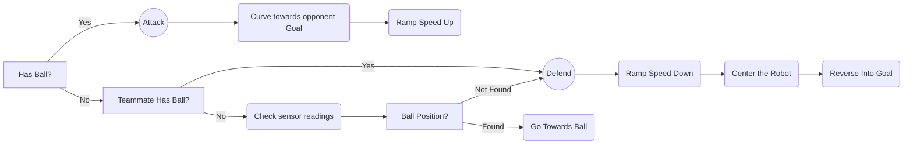

# Monkey Madness

## 2022 RoboCup Junior Australia

### Soccer Standard

### **Introduction:**

We are a small robotics team of 2 year 9s from Melbourne High School based in South Yarra. We operate on a weekly basis with the help of fellow peers. We have a variety of experience in various robotics competition 

### **Strategy:**
**Game:**
Our strategy for this competition...

**Building:**
Our Robots were designed for durability and power rather than extreme found. Based on previous competitions, we found that robots able to overpower the other team could gain ball possession far more than a lightweight but fast robot.

**Robot Logic:**

### **Robot Design:**
Our design choices for this competition were to use 2 identical robots with 4 EV3 Large Motors, 2 I2C IR Sensors, 1 I2C Compass Sensor and an EV3 Ultrasonic Sensor. We decided that the identity between robots would help resolve issues and keep code as similar as possible. 

### **Robot Code:**
Our robots are coded in [Python](https://www.python.org/) using a library called [ev3dev](https://www.ev3dev.org/). All our code is publicly available on our [GitHub repository](https://github.com/denyahnov/rc2022/). 

Our code is organised in a a system of 'Main', 'Testing' and 'Simulation' scripts. We have our main loop in **`recode.py`** and **`utils.py`** consists of all our utilities. We use Testing whenever we need to calibrate or test our sensors/motors as well as some scripts we were playing around with. Simulation was used for our practice in [EV3Sim](https://ev3sim.mhsrobotics.club/), an application developed by the school to practice coding in a virtual environment.

Our code accounts for robot inconsistency and faulty sensors. The main chunk of logic stays the same but small functions like converting ball position to robot direction has configurable variables that shift between robots.

We use bluetooth communication between to robots to...

**Photos:**
