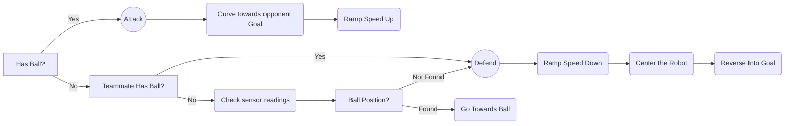

# Monkey Madness

## 2022 RoboCup Junior Australia

### Soccer Standard

### **Introduction:**

We are Dennis and Riveen, a group of year 9s from Melbourne High School. We are a small team of 2 and operate on a weekly basis. We have a variety of experience in various robotics competitions and have competed in RoboCup before, although this is the first time we are using python for robotics.

### **Strategy:**
**Game:**
Our strategy for this competition was to try hold ball possession for as long as possible throughout the matches. We found that...

**Building:**
Our Robots were designed for durability and power rather than extreme speed. Based on previous competitions, we found that robots able to overpower the other team could gain ball possession far more than a lightweight but fast robot. The choice to use EV3 Large Motors for our drivebase was a result of this consideration, as we found that the heavier and larger motors produce more power than the smaller EV3 Medium Motors which are favorable for many teams.

**Robot Logic:**

### **Robot Design:**
Our design choices for this competition were to use 2 identical robots with 4 EV3 Large Motors, 2 I2C IR Sensors, 1 I2C Compass Sensor and an EV3 Ultrasonic Sensor. We decided that the identity between robots would help resolve issues and keep code as similar as possible. 

Because of the limited time working on the robot in person, we began testing out with different robot designs using parts from home or [Studio 2.0](https://www.bricklink.com/v2/build/studio.page), a virtual LEGO builder.

### **Robot Code:**
Our robots are coded in [Python](https://www.python.org/) using the [ev3dev](https://www.ev3dev.org/) library. All our code is publicly available on our [GitHub repository](https://github.com/denyahnov/rc2022/). 

We run the main chunk of our code in a single main loop, which uses utilities and functions from other files. We use a sperate thread for bluetooth communication. We started off by using [EV3Sim](https://ev3sim.mhsrobotics.club/), an application developed by the school to practice coding in a virtual environment. It helped us build the foundation of our code while working from home.

Our code accounts for robot inconsistency and faulty sensors. The main chunk of logic stays the same but small functions like converting ball position to robot direction has configurable variables that shift between robots.

We use bluetooth communication between to robots to...

### **Photos:**
**Prototypes:**

**Other:**

